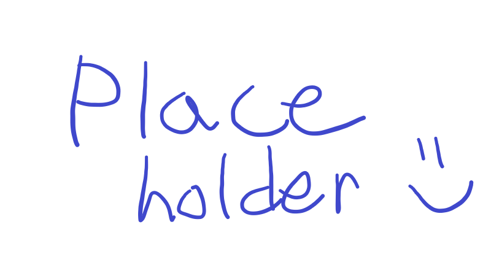

___

### Fabric port of [Steel Armor Blocks](https://www.curseforge.com/minecraft/mc-mods/steel-armor-blocks). Elegant metal blocks designed for use with Create: Big Cannons & Valkyrien Skies.

 

 

___

Lorem ipsum

___

# 🤝 Compatibility
- Comes with built-in Valkyrien Skies data!

---

# 💗 Credits & Thanks

Textures were mostly taken from [Steel Armor Blocks,](https://www.curseforge.com/minecraft/mc-mods/steel-armor-blocks) which is used & licensed under CC BY 4.0. Other textures were otherwise made or recoloured by me using the aforementioned assets.

Also, I want to commend Kaupenjoe for his free tutorials on YouTube to brief me on how some things work lol

___

Also, check out my very lovely sponsor and help me <s>take over</s> improve the world! I genuinely love DediMC's services, and its incredible customer support has won me over.

